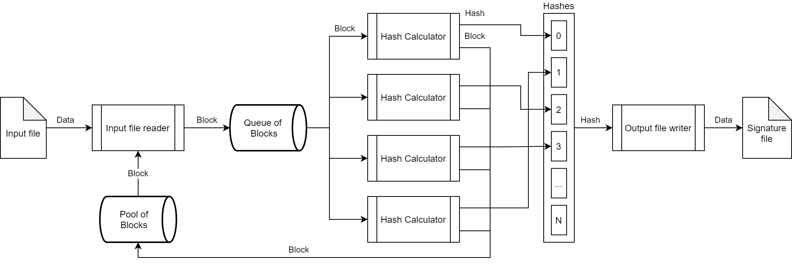

Signature Generator
=====================================

Author: Dmitriy Dronov

What is Signature Generator?
----------------

Signature Generator is a command line program in C++ to generate the signature of a given file. The signature is generated as follows: the source file is divided into equal (fixed) length blocks. When the source file size is not divisible by block size, the last fragment complemented with zeroes to full block size. An SHA256 hash value is calculated for each block and then added to the output signature file.

How to build it properly
-------

The project uses boost library v1.76.0. The library is excluded from the repository for saving space.
You can modify project dependencies and set the path to the library or copy boost in the root with name "boost_1_76_0". Make sure static libs are built.

General scheme of work
-------

Signature Generator is designed to provide maximum performance in a multiprocessor environment. The scheme below shows common entities and data transferring. It shows only general idea of the work, so the details are omitted.
